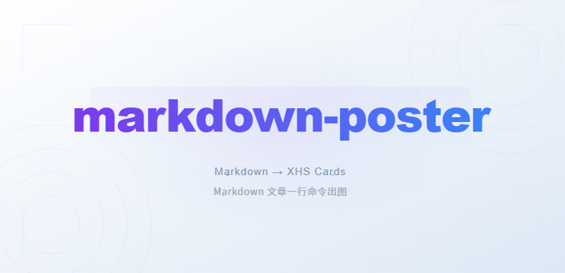
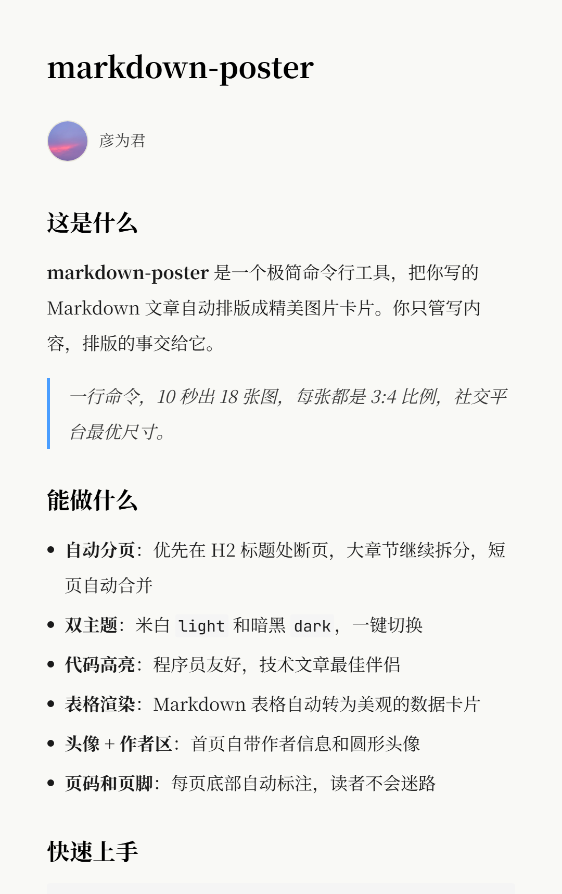
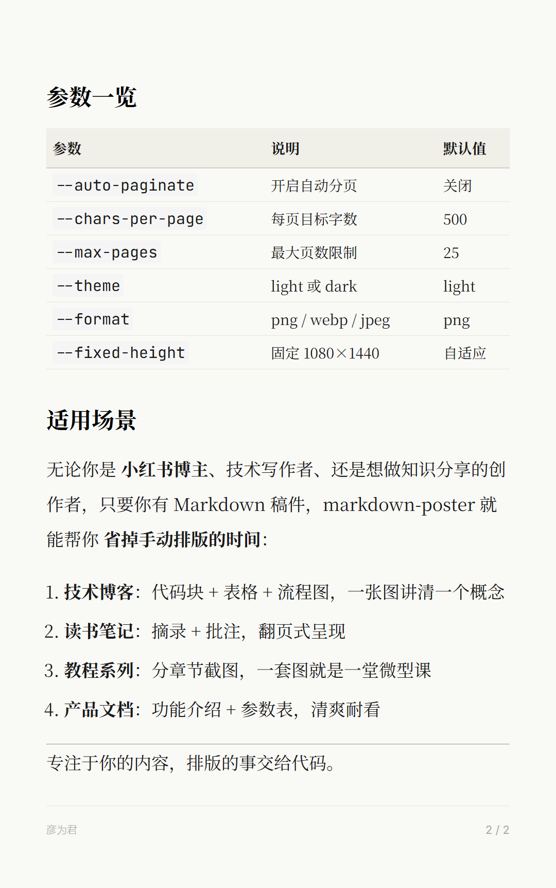

# markdown-poster

**Markdown → 小红书图文卡片，一行命令出图。**

<div align="center">
  
</div>

将 Markdown 文章自动排版成精美的社交媒体图片。支持自动分页、双主题、3:4 比例，专为中文长文优化。

## 功能亮点

- **自动分页** — 根据字数和标题智能分页，支持手动调整
- **双主题** — Light / Dark 主题开箱即用，无需额外配置
- **中文优化** — 完美支持中文排版、字体、折行，专为小红书调优
- **灵活输出** — PNG / WebP / JPEG 三种格式，支持固定或自适应高度
- **配置驱动** — 支持 YAML 配置文件 + CLI 参数混合，易于批量生成
- **开发友好** — 完整单元测试覆盖，HTML 预览可视化调试

## 效果预览

<div align="center">
  
  &nbsp;&nbsp;&nbsp;&nbsp;
  
</div>

## 快速开始

```bash
# 安装
pip install -e .
playwright install chromium

# 一行出图
markdown-poster article.md --auto-paginate -t "标题" -a "作者"
```

输出在 `output/` 目录下。

## 快速开始

### 基础示例

```bash
# 进入项目目录，指定源文件路径即可
cd markdown-poster
markdown-poster article.md --auto-paginate -t "文章标题" -a "作者名"

# 源文件也可以放在子目录
markdown-poster examples/basic/article.md --auto-paginate -t "标题" -a "作者"

# 带头像（相对于工作目录）
markdown-poster article.md --auto-paginate -t "标题" -a "作者" --avatar "./avatar.jpg"

# 带头像（绝对路径示例，Windows）
markdown-poster article.md --auto-paginate -t "标题" -a "作者" --avatar "C:\Users\YourName\Pictures\avatar.jpg"

# 暗色主题 + WebP
markdown-poster article.md --auto-paginate -t "标题" -a "作者" --theme dark --format webp

# 固定 1080×1440 比例（3:4）
markdown-poster article.md --auto-paginate -t "标题" -a "作者" --fixed-height

# YAML 配置驱动
markdown-poster -c poster.yaml

# 仅生成 HTML 预览（不截图）
markdown-poster article.md --auto-paginate -t "标题" -a "作者" --no-screenshot --open
```

输出默认在 `output/` 目录下，每张卡片按 `01.png`、`02.png`... 命名。

### 参数表

| 参数 | 说明 | 默认值 |
|------|------|--------|
| `-t, --title` | 文章标题 | — |
| `-a, --author` | 作者名 | — |
| `-d, --date` | 发布日期 | 今天 |
| `--avatar` | 头像图片路径 | 无 |
| `--footer` | 页脚文字 | 同作者名 |
| `--auto-paginate` | 自动分页 | 关闭 |
| `--chars-per-page` | 每页目标字数 | 500 |
| `--max-pages` | 最大页数 | 25 |
| `--theme` | light / dark | light |
| `--format` | png / webp / jpeg | png |
| `--fixed-height` | 固定 1080×1440 | 自适应 |
| `--no-screenshot` | 仅生成 HTML | 关闭 |
| `--open` | 浏览器打开 HTML | 关闭 |
| `-o, --output` | 输出目录 | output/ |
| `-c, --config` | YAML 配置文件路径 | — |

### YAML 配置

```yaml
# poster.yaml
src: article.md
title: "文章标题"
author: "作者"
date: "2026年5月6日"
avatar: avatar.jpg
footer: "页脚文字"
auto_paginate: true
chars_per_page: 500
max_pages: 25
theme: light
format: png
fixed_height: false
```

配置文件与 CLI 参数可混用，CLI 优先级更高。

## 项目结构

```
markdown-poster/
├── poster/
│   ├── cli.py          # Click CLI 入口
│   ├── config.py       # 配置系统 (YAML + CLI 合并)
│   ├── markdown.py     # mistune v3 渲染器
│   ├── builder.py      # HTML 拼装
│   ├── pagination.py   # 自动分页引擎
│   ├── screenshot.py   # Playwright 截图
│   └── themes/         # Light / Dark 主题
├── templates/
│   └── xhs.css         # CSS 设计系统
├── tests/              # 34 项单元测试
├── examples/           # 示例文章
└── pyproject.toml
```

## 技术栈

| 组件 | 技术 |
|------|------|
| Markdown 解析 | mistune v3 |
| 截图 | Playwright (Chromium) |
| CLI | Click |
| 配置 | YAML |
| 字体 | Noto Serif SC / Inter / JetBrains Mono |

## 分页说明

自动分页优先在 H2 标题处断页，过大章节会在段落边界继续拆分，短页自动合并。每页目标 500 字符，适合 3:4 比例卡片的一屏内容。

| 场景 | 建议参数 |
|------|---------|
| 短文章 (< 2000 字) | 默认即可 |
| 长文章 (> 5000 字) | `--chars-per-page 550 --max-pages 30` |
| 18 张限制 | `--chars-per-page 700 --max-pages 18` |
| 代码多 | 降低 chars-per-page |

## FAQ

### Q: 头像图片显示不出来

**A:** 检查以下几点：
1. 头像文件是否存在，路径是否正确
2. 如果用相对路径，需要从你运行命令的目录来看（通常是项目根目录）
3. 如果不传 `--avatar`，默认会找 `avatar.jpg`，不存在则不显示
4. 推荐用绝对路径避免歧义：`--avatar "/Users/yourname/Pictures/avatar.jpg"`（macOS）或 `--avatar "C:\Users\YourName\Pictures\avatar.jpg"`（Windows）

### Q: 生成的图片文字太小/太大了

**A:** 调整 `--chars-per-page`：
- 字数越少，每页容纳更多空白，文字显得更大
- 字数越多，页数增多，每页内容更紧凑
- 建议先试 500（默认）, 不满意改成 600 或 400

### Q: 如何让所有卡片固定为 1080×1440？

**A:** 使用 `--fixed-height` 标志：
```bash
markdown-poster article.md --auto-paginate -t "标题" -a "作者" --fixed-height
```
默认是根据内容自动计算高度。固定高度更适合分享到小红书（3:4 标准）。

### Q: 能否在多个位置运行命令而不用每次指定完整路径？

**A:** 可以用 YAML 配置文件：
```bash
markdown-poster -c poster.yaml
```
配置文件与 CLI 参数混用时，CLI 参数优先级更高。

### Q: "18 张限制"是什么意思？

**A:** 小红书图文卡片的上限是 20 张，其中前 2 张可能被首页预览占用，所以实际建议不超过 18 张用于内容展示。你可以用 `--max-pages 20` 调整上限（但上传时受平台限制）。

### Q: 支持哪些 Markdown 元素？

**A:** 支持标准 Markdown + 扩展：
- 标题、段落、列表、表格、代码块
- 加粗、斜体、行内代码、链接、图片
- 引用块、分隔线、任务列表

不支持的元素会被忽略或降级为纯文本。

## License

MIT
